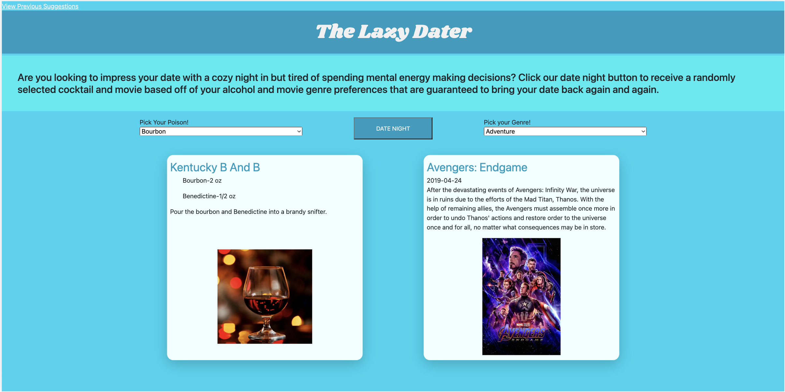

# The-Lazy-Dater

## Description

This website is built with HTML, CSS, and Javascript. It utilizes two APIs, the Cocktail Database and the Movie Database, to pull in cocktail and movie information. The website is built with a responsive design which allows the user to easily access it from any size device.

## Installation

N/A

## Usage

This website allows a user to click the "date night" button to randomly generate a suggested cocktail and movie based off their preferred alcohol and move genre. It saves the user mental energy having to think about what to drink and watch and allows the user to just enjoy a unique date night in. It also saves past suggestions that the user can easily access by clicking the "view previous suggestions" link. 

[The Lazy Dater](https://fdjoss.github.io/The-Lazy-Dater/)

## Credits
[Anna Perlack,](https://github.com/annaperlack/)
[Christopher Purnell,](https://github.com/Ctpurnell/)
[Daniel Prussia,](https://github.com/Billthebaker/)
[Fred Joss,](https://github.com/FDJoss/)
[Vinny Lopez](https://github.com/vlopez99/)

## License

N/A

## Installation

N/A

